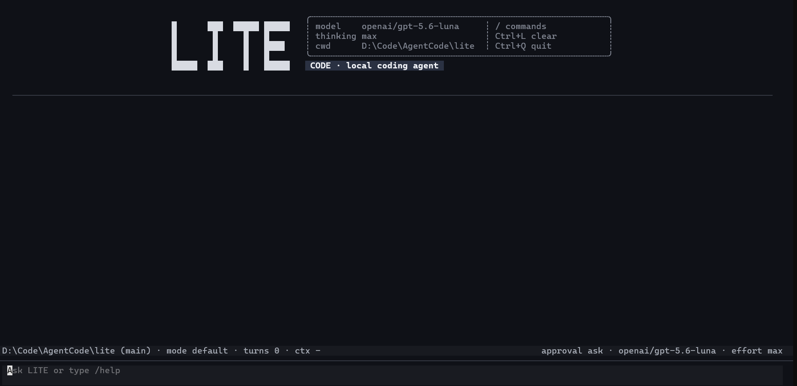

# Lite-Code

Lite-Code 是一个运行在本地仓库里的终端 coding agent。它使用你配置的模型
provider 读取代码、搜索文件、执行命令、修改工作区，并把 session、事件和运行
证据保存在本地。

CLI 命令名是 lite，项目名是 Lite-Code。

  

## 特性

| 能力 | 说明 |
| --- | --- |
| 本地优先 | 在当前仓库上下文中工作，不依赖托管控制面。 |
| 多 provider | 支持 OpenAI-compatible 和 Anthropic-compatible 协议。 |
| 统一工具链 | 文件读取、搜索、shell、写入、patch、审批和子 agent 走同一套 runtime。 |
| 可恢复 session | 保存对话、事件流、运行 trace 和报告，可以继续上次工作。 |
| 记忆 | 通过 working memory、daily log 和 durable topics 沉淀项目上下文。 |
| 安全控制 | 支持操作审批、shell sandbox 和敏感环境变量脱敏。 |
| 可扩展 skills | 用 Markdown 定义 /review、/test 或项目自己的工作流。 |

## 快速开始

要求：Python 3.10 或更高版本，以及至少一个可用的模型 API key。

~~~bash
git clone https://github.com/Z-XingRen/Lite-Code.git
cd Lite-Code

python -m venv .venv
# macOS / Linux
source .venv/bin/activate
# Windows PowerShell 使用：.venv\Scripts\Activate.ps1

python -m pip install --upgrade pip
python -m pip install -e .
~~~

设置 API key 后启动：

~~~bash
# macOS / Linux
export OPENAI_API_KEY=sk-...

# Windows PowerShell
$env:OPENAI_API_KEY = "sk-..."

lite
~~~

首次使用时，建议复制项目配置模板：

~~~bash
cp .lite.toml.example .lite.toml
~~~

Windows PowerShell：

~~~powershell
Copy-Item .lite.toml.example .lite.toml
~~~

.lite.toml 默认被 Git 忽略。它适合保存 provider、协议、模型和 endpoint；
API key 建议放在环境变量或 .env 中，不要提交到仓库。

## Provider 配置

最小的 OpenAI-compatible 配置如下，把 your-model 换成实际模型名：

~~~toml
provider = "openai"

[providers.openai]
protocol = "openai"
base_url = "https://api.openai.com/v1"
model = "your-model"
~~~

Anthropic-compatible endpoint 使用同样的结构，只需把 protocol 改为
anthropic，并填写对应的 base_url 和模型。兼容 Anthropic 协议的其他 provider
也可以使用 protocol = "anthropic"。

配置优先级：

~~~text
CLI 参数 > 项目 .lite.toml > 全局 ~/.config/lite/config.toml > 环境变量/.env > 默认值
~~~

常用环境变量：

| 变量 | 用途 |
| --- | --- |
| OPENAI_API_KEY / OPENAI_BASE_URL / OPENAI_MODEL | OpenAI-compatible provider |
| ANTHROPIC_API_KEY / ANTHROPIC_BASE_URL / ANTHROPIC_MODEL | Anthropic-compatible provider |
| DEEPSEEK_API_KEY / DEEPSEEK_BASE_URL / DEEPSEEK_MODEL | DeepSeek provider |
| LITE_PROVIDER | 默认 provider profile |
| LITE_API_KEY / LITE_BASE_URL / LITE_MODEL | 通用兼容 fallback |

临时覆盖配置：

~~~bash
lite --provider openai --model your-model
lite --provider deepseek --approval ask --max-steps 80
lite --config /path/to/config.toml --cwd /path/to/repo
~~~

完整配置说明见 [docs/configuration.md](docs/configuration.md)。

## 运行方式

~~~bash
lite                              # 交互式终端默认启动 TUI
lite --tui                        # 显式启动 Textual TUI
lite --repl                       # 使用普通行式 REPL
lite "找出测试失败的根因"          # 执行一次 one-shot 任务
lite --prompt-file task.txt       # 从 UTF-8 文件读取一次性任务
lite --resume latest              # 继续最近的 session
lite --cwd /path/to/repo          # 指定工作目录
~~~

常用运行控制：

~~~bash
lite --approval ask               # 高风险操作前询问，默认策略
lite --approval auto              # 自动批准操作
lite --approval never             # 禁止交互式审批
lite --sandbox best_effort        # 尽量使用 shell sandbox
lite --sandbox required           # 没有可用 sandbox 时拒绝执行 shell
lite --no-auto-dream              # 关闭后台 memory 整合
lite --max-steps 80               # 限制一次请求的工具/模型迭代次数
~~~

运行 lite --help 查看完整参数。sandbox 的详细边界和平台限制见
[docs/sandbox.md](docs/sandbox.md)。

## 交互命令

进入 TUI 或 REPL 后，可以输入自然语言，也可以使用 slash command：

~~~text
> /help
> /model
> /plan 重构 provider 配置加载逻辑
> /review
> /remember 这个项目使用 pytest
> /dream
~~~

常用内置命令：

| 命令 | 作用 |
| --- | --- |
| /help | 查看命令列表。 |
| /model [name] | 选择模型和 reasoning effort，或直接切换模型。 |
| /session | 查看当前 session 状态和文件路径。 |
| /history / /resume <id\|latest> | 查看并恢复历史 session。 |
| /context / /usage | 查看上下文使用量和 provider 使用元数据。 |
| /memory / /working-memory | 查看 durable memory 和当前工作记忆。 |
| /remember <text> | 写入一条 daily log 记忆。 |
| /dream | 将 daily log 整理为 durable topics。 |
| /plan <topic> | 创建并进入 plan mode。 |
| /plan-exit | 退出 plan mode。 |
| /agents | 查看子 agent 状态。 |
| /compact | 压缩较早的 session 历史。 |
| /tree | 查看 append-only Session Tree 和当前 head。 |
| /branch <entry\|label> | 把会话 head 移到已有节点；下一条消息会形成分支。 |
| /rewind [steps] | 将 head 回退若干节点，不修改工作区文件。 |
| /label <name> | 给当前 head 添加稳定标签。 |
| /clear | 创建新的空 session。 |
| /exit | 退出 Lite-Code。 |

内置 skills 包含 /review、/test、/commit 和 /simplify。项目和用户也可以
通过 Markdown 定义自己的 skill。详见 [docs/skills.md](docs/skills.md)。

## 状态、记忆和证据

Lite-Code 的运行状态默认写入工作区的 .lite/，该目录适合本地使用，不应提交：

| 内容 | 默认路径 |
| --- | --- |
| 项目配置 | .lite.toml |
| 全局配置 | ~/.config/lite/config.toml |
| 旧 Session / 迁移源 | .lite/sessions/<id>.json |
| 权威 Session Journal | .lite/sessions/<id>.journal.jsonl |
| 事件流 | .lite/sessions/<id>.events.jsonl |
| 运行证据 | .lite/runs/<run_id>/ |
| Memory 索引 | .lite/memory/MEMORY.md |
| Daily logs | .lite/memory/logs/YYYY/MM/YYYY-MM-DD.md |
| Durable topics | .lite/memory/topics/*.md |
| Plan artifacts | .lite/plans/ |

记忆的工作方式和自动 dream 策略见 [docs/memory.md](docs/memory.md)。
Journal 与 Session Tree 的记录格式、投影和恢复约束见
[SESSION_TREE.md](SESSION_TREE.md)。

## Skills

Skill 是写在 Markdown 文件中的可复用工作流。加载顺序为：

1. Lite 内置 skills
2. 用户目录 ~/.lite/skills/<name>/SKILL.md
3. 项目目录 skills/<name>/SKILL.md 或 .lite/skills/<name>/SKILL.md

示例：

~~~markdown
---
name: deploy
description: 部署前检查
argument-hint: target
allowed-tools: read_file, search
---

检查 $ARGUMENTS 环境的测试、配置和发布清单。
~~~

调用：

~~~text
> /deploy staging

~~~

## 开发和测试

安装开发依赖后运行测试：

~~~bash
python -m pip install -e .
python -m pip install pytest pytest-asyncio ruff

python -m pytest tests -q
python -m ruff check lite tests
~~~

使用 uv 时，可以直接同步项目声明的开发依赖：

~~~bash
uv sync --group dev
uv run pytest tests -q
~~~

需要真实 provider 的 smoke test：

~~~bash
LITE_LIVE_SMOKE=1 python -m pytest tests/test_release_smoke.py -q
~~~

真实 provider 测试需要可用的 API key 和 endpoint；普通单元测试不应依赖网络。

采集 Workspace Change Tracker 与 Journal Effect 恢复证据：

~~~bash
python scripts/run_runtime_evidence.py --output-dir artifacts/runtime-evidence --workspace-file-counts 5000 --workspace-changed-counts 1 --workspace-runs 30 --recovery-repetitions 10
~~~

该命令执行透明工具的增量追踪/全量快照对照、6 类 Effect × 3
个崩溃阶段的恢复矩阵，以及 1K/5K/10K Journal scaling，输出三个 JSON
和 Markdown 摘要。实验完全使用本地确定性路径，不调用真实 provider；
恢复矩阵默认保留 Journal fsync，scaling 关闭 fsync 以隔离在线投影成本。

## 项目结构

~~~text
lite/
├── cli.py                 # CLI 参数、启动模式和 REPL
├── config/                # provider profile、TOML 和环境变量解析
├── core/                  # runtime、engine、session、context 和 workers
├── features/              # memory、skills 和 sandbox
├── providers/             # OpenAI-compatible / Anthropic-compatible client
├── tools/                 # 工具协议、注册表和具体工具
├── tui/                   # Textual 终端界面
└── evaluation/            # evidence、metrics 和评估辅助逻辑
~~~

更多设计和运行说明：

- [配置](docs/configuration.md)
- [Memory](docs/memory.md)
- [Sandbox](docs/sandbox.md)
- [Skills](docs/skills.md)

## License

MIT
